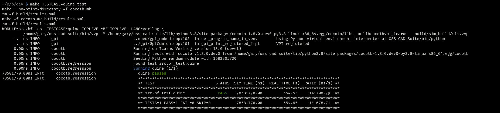

# bfchip: Brainf*** CPU
Gary Bailey \
Spring 2023 Final Tapeout Project \
[18-224: Special Topics in Chip Design](https://courses.ece.cmu.edu/18224)

## Overview
This project implements a simple CPU (written in SystemVerilog) which interprets
the esoteric programming language Brainf*** (BF) as its machine code. The
version of BF implemented by this project actually contains one extension: in
addition to the eight standard BF instructions `+-<>[].,`, a ninth instruction
`\0` (0-byte) is implemented, which halts the CPU. Architecturally, this CPU is
similar to the Harvard architecture, with separate 16-bit program and data
address spaces.

## How it Works
This project consists mainly of two modules: `BF` (`dev/src/bf.sv`), the BF
core, which actually implements the CPU core, and `my_chip` (`dev/src/chip.sv`),
the bus interface, which translates the BF core's bus protocol.

### BF Core
The BF core itself contains four registers:
- `pc`, the program counter
- `cursor`, the address of the currently selected cell
- `acc`, the accumulator
- `depth`, the nested loop depth of the current instruction when jumping forward
  or backward

These registers each have a set of operations which are defined in `consts.sv`.
These operations are packed into the microinstruction word, which is output by
each state in the main FSM.

The FSM has 33 states in total. Its overall logical strucure is as follows. I've
also included the alphabetic names used to refer to each instruction within the
source code. (here, "instruction" refers to the byte in program memory at the
program counter, and "cell" refers to the byte in data memory at the cursor)

- Fetch/decode: Fetch instruction, increment `pc`, then:
  - if the instruction is one of the recognized instructions, go to that
    instructions's stage
  - otherwise, return to Fetch/decode
- Inc (`+`): Fetch cell, load cell into `acc`, store `acc+1` into cell, return
  to Fetch/decode
- Dec (`-`): Fetch cell, load cell into `acc`, store `acc-1` into cell, return
  to Fetch/decode
- Right (`>`): Increment `cursor`, return to Fetch/decode
- Left (`<`): Decrement `cursor`, return to Fetch/decode
- Print (`.`): Fetch cell, load cell into `acc`, write `acc` to I/O, return to
  Fetch/decode
- Read (`,`): Fetch I/O, load I/O into `acc`, store `acc` into cell, return to
  Fetch/decode
- Brz (`[`): Fetch cell, clear `depth`, then:
  - if cell is nonzero, return to Fetch/decode
  - (loop) if cell is zero, fetch instruction and increment `pc`:
    - if the instruction is `[`, increment `depth` and loop
    - if the instruction is `]`:
      - if `depth` is zero, return to Fetch/decode
      - if `depth` is nonzero, decrement `depth` and repeat loop
    - otherwise, loop
- Brnz (`]`): Fetch cell, clear `depth`, then:
  - if cell is zero, return to Fetch/decode
  - if cell is nonzero, decrement `pc` twice, then
  - (loop) fetch instruction and decrement `pc`:
    - if the instruction is `]`, increment `depth` and loop
    - if the instruction is `[`:
      - if `depth` is zero, increment `pc` twice and return to Fetch/decode
      - if `depth` is nonzero, decrement `depth` and loop
    - otherwise, loop
- Halt (`\0`): Do nothing and repeat

### Bus Interface
There is a secondary module which translates the 24-output, 8-input bus of the
BF core into a multiplexed, 11-output, 8-input bus to fit within the port
constraints of our tapeout. This consists of a very simple FSM which detects
when the BF core makes a memory or IO request. When this occurs, it disables the
core and successively sends the bus opcode, two address bytes, and written byte
(if applicable) on the output bus, and then waits for an external memory/IO
controller to assert `op_done` before continuing execution. See [Hardware
Peripherals](#hardware-peripherals) for more info about this protocol.

## I/O

### Inputs

| Input | Assignment  |
|-------|-------------|
|     0 | `bus_in[0]` |
|     1 | `bus_in[1]` |
|     2 | `bus_in[2]` |
|     3 | `bus_in[3]` |
|     4 | `bus_in[4]` |
|     5 | `bus_in[5]` |
|     6 | `bus_in[6]` |
|     7 | `bus_in[7]` |
|     8 | `op_done`   |
|     9 | `enable`    |
|    10 | *(NC)*      |
|    11 | *(NC)*      |

#### `bus_in[7:0]`
The bus input value to be passed to the BF core.

#### `op_done`
Asserted by the memory/IO controller to indicate that the requested operation is
complete.

#### `enable`
Full system-wide enable. When deasserted, the clock has no effect.

### Outputs

| Output | Assignment   |
|--------|--------------|
|      0 | `bus_out[0]` |
|      1 | `bus_out[1]` |
|      2 | `bus_out[2]` |
|      3 | `bus_out[3]` |
|      4 | `bus_out[4]` |
|      5 | `bus_out[5]` |
|      6 | `bus_out[6]` |
|      7 | `bus_out[7]` |
|      8 | `state[0]`   |
|      9 | `state[1]`   |
|     10 | `state[2]`   |
|     11 | `halted`     |

#### `bus_out[7:0]`
The bus output value to be handled by the memory controller. The meaning of its
value is determined by the value of `state`.

#### `state[2:0]`
The "bus state". Defines what is currently being sent an received from `bus_out`
and `bus_in`. Has the following possible values:

| `state`  | Name          | Meaning                        |
|----------|---------------|--------------------------------|
| `3'b000` | `IoNone`      | `bus_out` and `bus_in` ignored |
| `3'b001` | `IoOpcode`    | `bus_out[2:0]` is the bus opcode    |
| `3'b010` | `IoAddrHi`    | `bus_out` is `addr[15:8]`      |
| `3'b011` | `IoAddrLo`    | `bus_out` is `addr[7:0]`       |
| `3'b100` | `IoReadWrite` | `bus_out` is the value being written by the BF core, if any, and `bus_in` is passed to the BF core as input |

The bus opcode can have the following values (the first 5 bits of `bus_out` are
ignored during the opcode step):

| `opcode` | Name           | Operation                    |
|----------|----------------|------------------------------|
| `3'b000` | `BusNone`      | No operation                 |
| `3'b010` | `BusReadProg`  | Read from the program memory |
| `3'b100` | `BusReadData`  | Read from the data memory    |
| `3'b101` | `BusWriteData` | Write to the data memory     |
| `3'b110` | `BusReadIo`    | Read from I/O                |
| `3'b111` | `BusWriteIo`   | Write to I/O                 |

See [Hardware Peripherals](#hardware-peripherals) for more info.

#### `halted`
When asserted, the BF core has halted.

### Clock and reset
This chip uses active-high, synchronous reset. The clock speed is not strict.

## Hardware Peripherals
In order for the BF core to operate, the `bus_out`, `bus_in`, `state`, and
`op_done` lines must be connected to a memory/IO controller which implements the
following protocol:

- When `state == IoOpcode`, store `bus_out` to `opcode` on clock
- When `state == IoAddrHi`, store `bus_out` to `addr[15:8]` on clock
- When `state == IoAddrLo`, store `bus_out` to `addr[7:0]` on clock
- When `state == IoReadWrite`:
  - If `opcode == BusReadProg`, set `bus_in` to the byte of program memory at
    address `addr`, then assert `op_done`
  - If `opcode == BusReadData`, set `bus_in` to the byte of data memory at
    address `addr`, then assert `op_done`
  - If `opcode == BusWriteData`, store `bus_out` to the byte of data memory at
    address `addr` on the clock, then assert `op_done`
  - If `opcode == BusReadIo`, set `bus_in` to the first-in byte of the input
    stream, then assert `op_done`, and on the clock remove that byte from the
    queue
  - If `opcode == BusWriteIo`, write `bus_out` to the output stream on the
    clock, then assert `op_done`

The exact implementation/layout of the memory and I/O interfaced with the CPU is
up to the designer of the memory/IO controller. Reasonable options would be a
SPI flash interface for the program memory, SPI SRAM for the data memory, and a
UART interface connected to a terminal for the I/O. Beyond the interface itself,
the controller must make sure to zero-out the data memory before program
execution begins.

## Design Testing / Bringup
The BF core itself is tested in simulation with CocoTB and is known to work on
the Icarus backend. Running `make test` in `dev/` will run the test suite, which
can be found in `dev/src/tests/`. The test suite consists of example BF
programs. Some of the tests are skipped by default due to taking too long to
execute in simulation, but they can be manually run using `make TESTCASE=<case>
test`

The `dev/src/fpga_test.py` script, when connected to the debug interface, will
act as the memory/IO controller and run a program on the CPU. It needs to be
passed a TOML file containing a program, inputs, and expected outputs. Several
of these programs can be found in `dev/src/tests/`.

To test the design after manufacture, implement a memory/IO interface as defined
in [Hardware Peripherals](#hardware-peripherals), and use it to run BF test
programs on the CPU, such as those included in `dev/src/tests/`.

## Media
Hello World program successfully running on FPGA, using the debug interface: \

Test suite passing: \
 \

