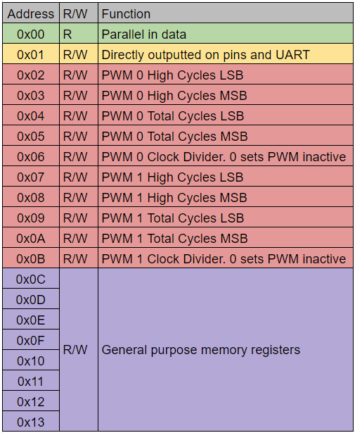
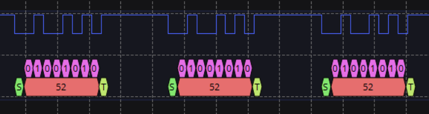
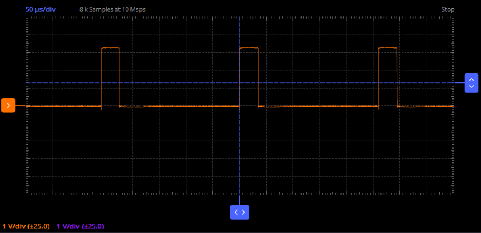
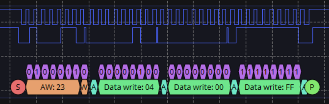
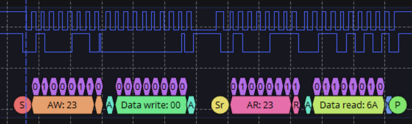
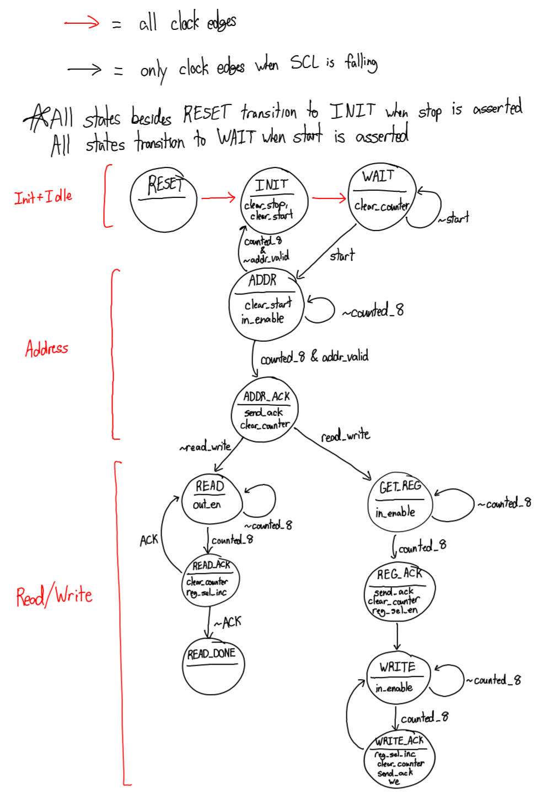
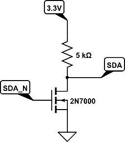
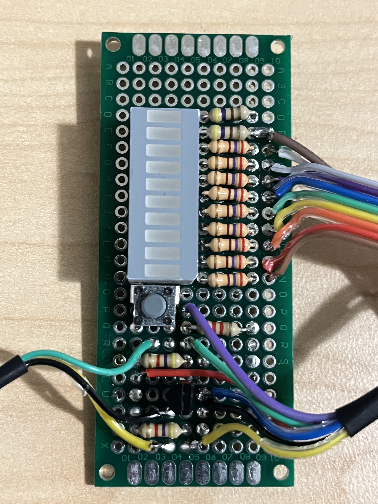
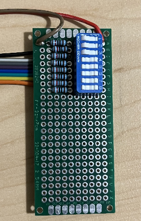
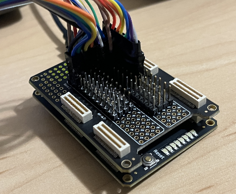

# I2C I/O Peripheral Device

Owen Ball
18-224/624 Spring 2023 Final Tapeout Project

## Overview

An I2C peripheral device with 24 8-bit registers. The device has one read only register
set to the value of 8 parallel inputs. The value of one register is outputted as a
parallel output. The device also features two PWM outputs controlled using the registers.

# Design Specifications 

## Clock Speed
In order for proper function of the I2C line, the input clock should be approximately 10 to 15 times the frequency of the bus. To operate at the standard I2C clock speed of 100kHz, a clock of at least 1MHz should be used.
## Inputs/Outputs

This design takes in a clock, active high reset, and has the following IO:

| Number  | Inputs  | Outputs  |
| :---:   |  :----: |  :---:   |
| 0       |   SCL   |  SDA_N   |
| 1       |   SDA   |  UART_TX |
| 2       |  ADDR_0 |  PWM_0   |
| 3       |  ADDR_1 |  PWM_1   |
| 4       |  D0_IN  |  D0_OUT  |
| 5       |  D1_IN  |  D1_OUT  |
| 6       |  D2_IN  |  D2_OUT  |
| 7       |  D3_IN  |  D3_OUT  |
| 8       |  D4_IN  |  D4_OUT  |
| 9       |  D5_IN  |  D5_OUT  |
| 10      |  D6_IN  |  D6_OUT  |
| 11      |  D7_IN  |  D7_OUT  |

The inputs consist of the SCL line, the SDA line, 2 address select lines, and 8 input pins. The data pins directly map to the read-only register 0x00 as shown in the register map below. The address pins indicate the desired I2C address of the design. The table below shows the address that corresponds to each combination of these pins.

| ADDR_1, ADDR_0 | I2C Address |
| :---:  | :---:   |
| 0,0    | 0x20    |
| 0,1    | 0x21    |
| 1,0    | 0x22    |
| 1,1    | 0x23    |

The first output is SDA_N, which is the inverted SDA output of the chip, which
should then be connected to the gate of an NMOS to pull the SDA line to ground.
The chip also has two PWM outputs and a UART output. The functionality of these pins will be discussed in later sections. The last set of outputs is the 8-bit value stored in register 0x01 on the design.

## Register Map

The design consists of 24 registers. 

- Register 0x00 is a read only register set to the value on the inputs D0_IN - D7_IN

- Register 0x01 is directly outputted onto D0_OUT - D7_OUT

- Registers 0x02-0x0B are used for controlling the PWM pins. However, they can be used
as memory registers if the PWM outputs are ignored or the PWM divider is set to 0.

- Registers 0x0C-0x17 are not assigned to any function and can be used as volatile I2C memory

 

## UART TX
The value in register 0x01 is continuously sent on output pin 1. 8 bits are sent per transmission with no parity bit. The line is held high for 7 bits worth of time before the next start bit is sent.

The baud rate can be determined by dividing the clock speed of the design by 52. For a 1MHz clock, this corresponds to 19200 baud, and for a 500kHz clock, this corresponds to 9600 baud.

## PWM
The design features two PWM outputs, each controlled by 5 registers. For each PWM output.
- The 'High Cycles' registers correspond to the number of clock cycles that the PWM output will be high for. 
- The 'Total Cycles' registers correspond to the number of clock cycles in one period of the PWM signal. If this value is lower than 'High Cycles,' the output will be held high.
- The clock divider register will be multiplied by the high time and period to allow for longer period PWM signals. Setting this register to 0 will deactivate the PWM output.     

When operating at 1MHz, it is recommended to set 'Total Cycles' to 16384 and operate 'High Cycles' between either 1000 and 2000 or 1024 and 2048.

## Writing to Registers
In order to write to a register, the coordinator device should first send the I2C device address, followed by the target register, then the data to store to the register. If multiple bytes of data are provided, the target register will be incremented by 1 for each byte sent. This will wrap around to address 0x00, although it is not recommended to make use of this functionality. Address 0x00 is read only and will ignore attempts to write to it.

An example transmission is shown below, where the device (address 0x23) has the bytes 0x00 and 0xFF written to registers 0x04 and 0x05.

## Reading From Registers
In order to read from a register, the coordinator should first write the desired register address to the I2C device address. A repeated start condition should then be used, after which the I2C device address should be sent again, this time with the read/write bit set to read. The device will then send the data stored in the specified register. The device will continue to send the values stored in subsequent registers until a stop condition is sent. This will wrap around to register 0x00.

All reads should first send the target register. Reading from the device without first sending the target register may yield the wrong data.

An example transmission is shown below, where the value of 0x6A is read from register 0x00 of the I2C device (0x23).

# How it Works

## FSM
The core of this design is the I2C peripheral functionality. All I/O is controlled either directly by the I2C controller or indirectly through the I2C registers. The I2C controller functions using an FSM and datapath to determine when to control the SDA line, when to send data, etc.

The FSM for the design is shown below. Note that for clarity, a few of the transitions have been omitted, as noted at the top.

The FSM consists of 4 main stages.
- Init+Idle: This stage prepares the design to receive a communication and puts it into a waiting state until the communication is started. Currently RESET serves no function, as the reset line directly controls the resetting of the I2C registers. However, if desired, this state could be made to reset only some parts of the design when an input is asserted
- Address: This stage receives the address being sent on the bus. If the address sent does not match the address of the design, it will return to its setup and waiting stage. If the address does match, and ACK will be sent and the state will be sent to either READ or GET_REG depending on the read/write bit.
- Write: This stage handles values being written to the I2C registers, or the sending of a register to be read from. This stage first reads in a byte from the bus, which is stored to a register select. An ACK is then sent. The design then reads in a byte in the WRITE stage, and will write this to the target register during the WRITE_ACK state. This state will also increment the register select for the next WRITE. If a read is being performed, the repeated start condition will move the FSM from the WRITE state to the ADDR state, and the register address written to the device will be remembered for the read operation.
- Read: Following the writing of the target register and the repeated start condition, the device will begin sending the data stored in the target register onto the bus. If an ACK is sent, the device will increment the target register and send another byte. If a NACK is sent, the design will move into the READ_DONE state, which will release the SDA line so a stop condition can be sent. This state is not necessary, and a return to WAIT would suffice.

## Registers

The 24 registers are multiplexed to a data line using the register select sent by the I2C coordinator device. For reading from the design, a single bit is then selected from this register and sent to the SDA line. All registers are volatile. Writes occur on falling edges of SCL and require a write enable. Register 0x00 will ignore attempts to write to it.

## I/O

Some of the I2C registers are used to determine the outputs sent to the PWM, UART, and parallel output pins. The PWM and UART pins use their own datapaths to control the outputs. These datapaths mostly include counters that divide down the main clock of the design and determine what the output should be at any given time.

# Design Testing / Bringup

## Hardware Peripherals

Both the iCE40 FPGA and the ASIC do not support leaving outputs as high impedance. As a result, in order to drive the SDA line, the SDA_N output of the chip must be fed into an NMOS with a pull-up resistor. The drain of the NMOS should then be connected to SDA. Thus when SDA_N is high, SDA is pulled to ground and otherwise, is pulled to 3.3V. The resistor value should be somewhere in the range of 2kOhm to 10kOhm, with the NMOS being capable of switching fast enough for the desired I2C speed and being able to overpower the SDA pull up resistors. Note that this chip does not perform clock stretching and as such, has no need to drive the SCL line. 

The design was tested on an iCE40 FPGA using a RPi Pico running CircuitPython as the coordinator. 

## Testing

Testing the I2C functionality can be achieved using the SCL, SDA, SDA_N (and accompanying hardware), the two ADDR_X lines, clock, and reset. Using the I2C coordinator, it can be verified that the design is responding to the proper address and the registers are functioning properly. This can be done by sending a write consisting of 23 different bytes starting at 0x01. A read of 24 bytes starting at 0x00 can then be performed, and it can be verified that these bytes read back match the bytes written to the design. If the design does not respond properly on the I2C bus, the clock and I2C bus speed should be slowed down until it does. 

Testing the PWM output can be done using an oscilloscope to verify that the time high and total time for the PWM signal match the values written to the control register.

UART testing can be verified using the coordinator device to read in the UART signal and verify that it matches the value stored in register 0x01.

Testing of the parallel inputs and outputs can either be done using 8 dip switches and 8 LEDs, or with GPIO pins on the coordinator device. 

## Alchitry Cu Testing Setup

The primary testing of the design was performed on the Alchitry Cu iCE40 FPGA. The FPGA was connected to a RPi Pico, as well as a SparkFun LCD and a Sparkfun LED Button. Additionally, two breakout boards were made for the FPGA, one for the SDA MOSFET, output LEDs, and a reset button, and one for input DIP switches. 

The Pico was set up to read the status of the I2C button, and increment a counter accordingly. This counter value is then sent to 8 of the output LEDs by writing to register 0x01. The two PWM pins are also updated according to the counter. Address 0x00 is then read to get the status of the DIP switches. The lower 6 bits of this are converted to an RGB color, which is then sent to the LCD screen backlight. The UART line can be connected to the Pico if desired. The Pico also will perform writes to every register on the device, then read from all the registers to verify their contents. 

The code used on the Pico can be found [here.](src/picocode.py)

# Media

[Video](media/testing_video.mp4)

