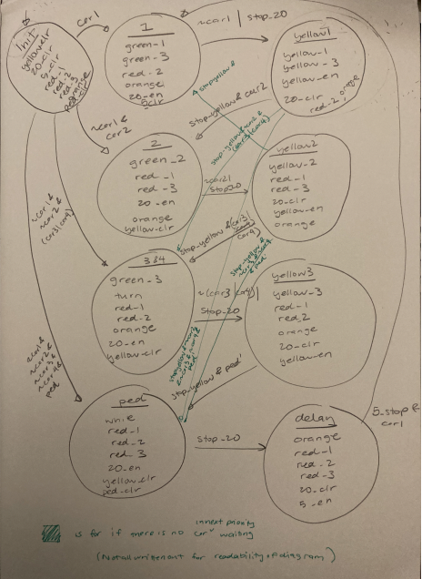

# Morewood traffic light
Jessie Fan
18-224/624 Spring 2023 Final Tapeout Project
## Overview
Functions as a traffic light & cross walk light signals 
which takes in inputs of which cars are waiting and if 
the pedestrian crossing button has been pressed. 
## How it Works
FSM-D
Uses an FSM (Moore style) to control the different states 
for each light for each car/ped waiting. Also uses 
multiple counters (to count the time allotted for cars to go
in each direction) and a register to hold whether the pedestrian
crossing button has been pressed.

## Inputs/Outputs
I plan to implement a 3-way traffic intersection that includes: 1 crosswalk that signals
when pedestrians should walk and when they should wait, 3 traffic lights for each
direction (one of these traffic lights will include a turn signal in addition to the standard
green, yellow and red lights).
Inputs:   
● 1 pedestrian waiting to cross input [ped]   
● 3 car waiting signals for each (straight) direction [car1, car2, car3]   
● 1 car waiting signal for the turning lane [car 4]    
Outputs:   
● 3 LEDS (red, yellow, green) for each direction (9 total) [red1, yellow1, green1, etc.]  
● 1 additional LED for the turn signal (could be any color) [turn]  
● 2 LEDS (orange and white) for whether the pedestrian should cross or not [orange,
white]  
## Design Testing / Bringup
I tested this design by picking plausible inputs (combinations of cars and pedestrians waiting) to 
plug into a test bench and visually check if the output (traffic lights) matches what I expected. 
## Media
file containing output of test bench is included  
`traffic_light.sim`
