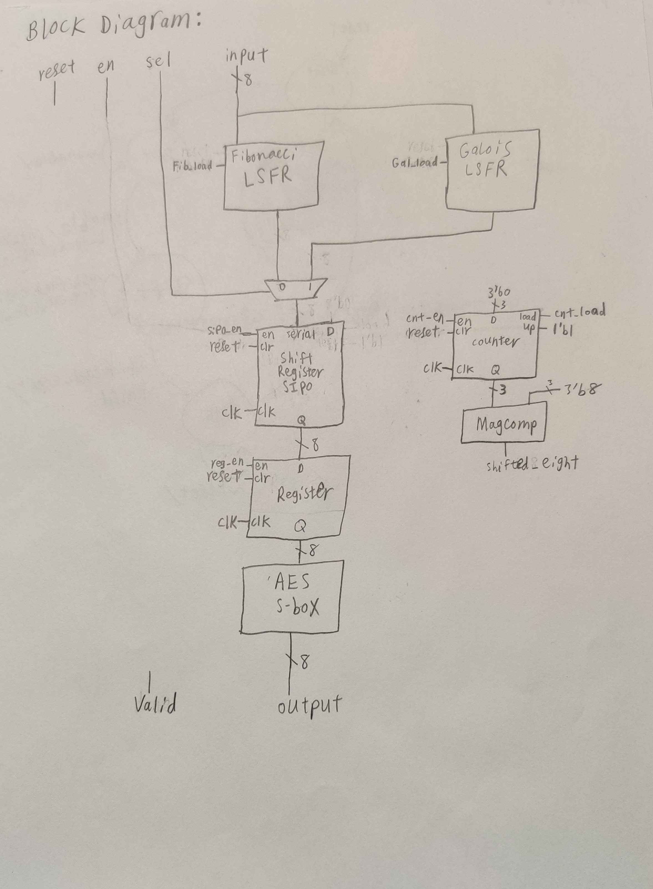
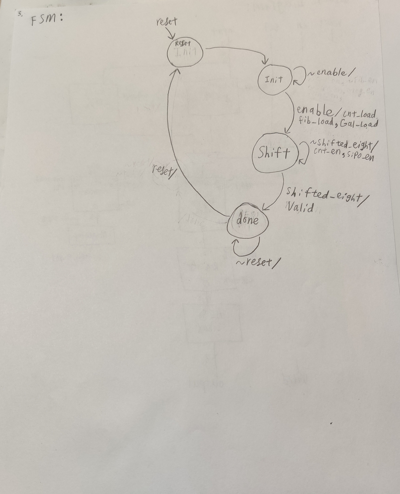
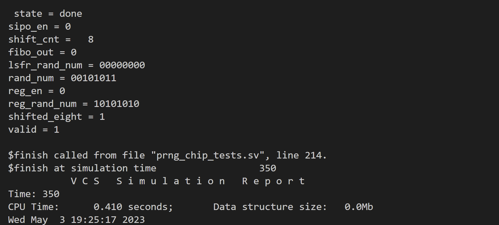
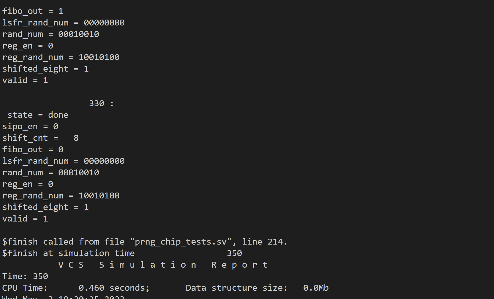

# Psuedo-Random Number Generator (PRNG) Chip
Jerry Feng
18-224/624 Spring 2023 Final Tapeout Project

## Overview
The PRNG chip takes an 8-bit seed number as input into the chip and outputs an 8-bit psuedo-random number

## How it Works
Seeds number is fed as input into the flip-flops of either a Fibonacci or Galois Linear Shift Register, 
8 shifts occur, where the output of one of the linear shift register's is stored in a SIPO shift register.
The value of the SIPO shift register is then stored in a normal register, and then fed through an AES S-box to generate the final output.
This is a datapath, which is controlled by a Mealy machine FSM.  Block diagram and FSM diagram can be seen below. 

Block Diagram:

FSM Diagram:

## Inputs/Outputs
My chip does not have a dependency on any certain clock frequency.

       inputs:
          - Select bit to select Fibonacci (0) or Galois (1) Linear Shift Register
          - Enable
          - Input bit 0
          - Input bit 1
          - Input bit 2
          - Input bit 3
          - Input bit 4
          - Input bit 5
          - Input bit 6
          - Input bit 7
          - none
          - none
        outputs:
          - Output bit 0
          - Output bit 1
          - Output bit 2
          - Output bit 3
          - Output bit 4
          - Output bit 5
          - Output bit 6
          - Output bit 7
          - Valid
          - none
          - none
          - none
    

## Design Testing / Bringup
Set reset pin high for one positive clock edge.  
Next positive clock edge set reset pin low, enable pin low, and set select and input pins to desired values.
Following positive clock edge set enable pin high, then set enable pin low on the next clock edge.
Step clock until you see valid pin go high, then the output random number will be the psuedo-random number generated.
                 
                 Sample Inputs and Outputs for Fibonacci mode (select = 0):
                  Inputs      Outputs
                 11001100 -> 10000011
                 00011000 -> 10100011
                 10101010 -> 00101011
                 
                 Sample Inputs and Outputs for Galois mode (select = 1):
                  Inputs      Outputs
                 11001100 -> 10100001
                 00011000 -> 00100011
                 10101010 -> 00010010
                 
                 

## Media
"Fibonacci mode" testbench output:

"Galois mode" testbench output:

## Acknowledgements
A big thanks to Anish Singhani and Professor Nace for all their hardwork in putting together this course and giving me this cool opportunity!
An additional thanks to Anish Singhani for all the debugging help!
