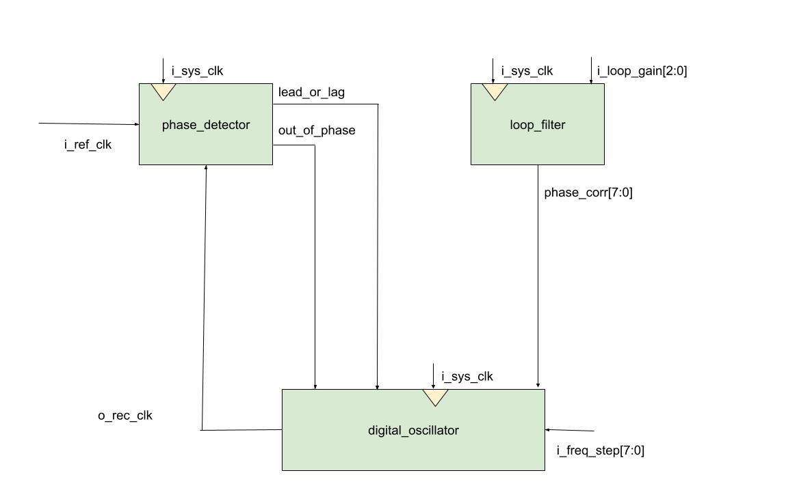
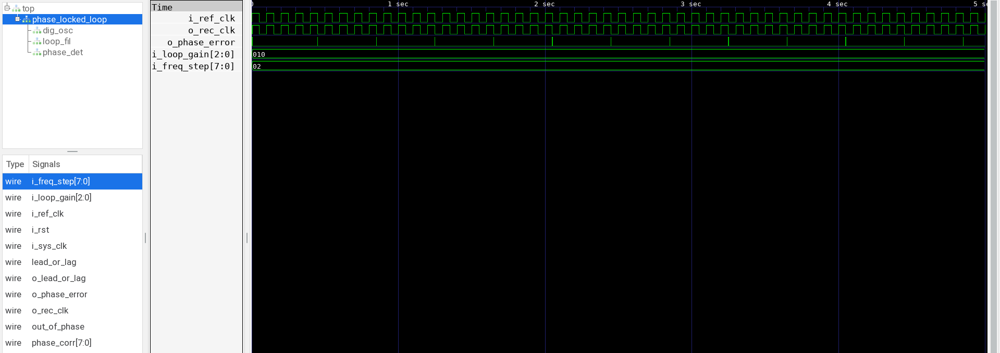

# Digital Phase-Locked Loop
Brandon Joel Gonzalez

18-624 Spring 2023 Final Tapeout Project

## Overview

This project is a digital phase-locked loop (PLL). A PLL takes in a reference signal and attempts to reconstruct a signal that matches the phase of the input. PLLs are often designed and used in analog circuitry, but digital designs can also achieve this functionality. A PLL can work with sine waves, but this PLL takes in a square wave (i.e. clock signal) and attempts to lock onto its phase.

## How it Works
A PLL is a feedback loop consisting of the following parts:
- A phase detector which takes the input reference signal and the reconstructed signal, producing a phase error which tells us how out-of-phase the two signals are
- A loop filter which provides some corrective factor
- A numerically-controlled oscillator that uses the error signal to generate an output signal that is fed back into the phase detector

This can be described by the following system-level block diagram:

For this digital PLL, since we are working with square waves, we can make a few simplifying assumptions:
- The phase detector will only need to compare the rising edges of the two clock signals to determine which changed first; from this, we know whether our reconstructed signal leads or lags the reference input
- The oscillator can just be implemented as a counter that continuously counts by some amount every clock cycle. We can look at the MSB of this counter to generate a square wave of varying frequencies. Depending on the frequency step value (which can be controlled as an input), we will get a different frequency for our reconstructed signal
- The loop filter can just be a control signal that affects the rate at which we increment our counter. If the reconstructed clock is severely lagging the input reference, then we need to speed up the rate at which we count; otherwise, we need to slow down the rate at which we count. This loop gain value is also controlled by user input

Comments are provided in [chip.sv](src/chip.sv) with further explanation of each submodule described above.

## Inputs/Outputs
Below are the I/O pins:
- i_sys_clk: the system clock, tested at 1000 kHz
- i_rst: a global reset, which is active high
- i_ref_clk: the input clock signal used as a reference signal
- i_loop_gain: a 3-bit value that can be used to control how quickly the PLL locks to the reference signal
- i_freq_step: an 8-bit value that changes how much the counter increments by, and thus the frequency of the reconstructed clock signal
- o_rec_clk: the reconstructed clock signal
- o_lead_or_lag: 1-bit value that indicates whether the reconstructed signal leads or lags the clock
- o_phase_error: 1-bit value that indicates whether the two clocks are in-phase or out-of-phase

## Hardware Peripherals
You can test this design by using any clock signal that is below 1000 kHz (which is the frequency of the system clock for the design); I chose a 10 Hz signal in my testbench. If you feed this clock signal as the input to the design, you should get out a reconstructed signal that attempts to match the phase of the input. It is important to try and pick a frequency step value such that the reconstructed signal matches the frequency of the reference signal. With this, you can use a microcontroller to generate a clock signal as the reference input to the design along with the other control signals, and then you can plot the input and output square waves on an oscilloscope for a visualization.

## Design Testing / Bringup
In testing the PLL, I found it difficult to write a traditional testbench that took in certain inputs and produced a specific output. This is because by its nature, the output of the PLL was a reconstructed clock signal that I would have to compare to the input in order to understand how well the PLL worked. Therefore, to test the PLL, I can feed a clock signal of an arbitary frequency and phase (below 1000 kHz) to the i_ref_clk pin. Then, using GTKWave in simulation or an oscilloscope in real hardware, I can inspect both i_ref_clk and o_rec_clk to determine how closely they match. I can also look at the o_phase_error pin to determine how well the "locking" mechanism of the PLL is working. [PLL_testbench.py](bench/PLL_testbench.py) contains the Python code used for testing; the .vcd file produced was viewed using GTKWave.

## Media
Below is a screenshot of the .vcd file produced by my testbench, as viewed in GTKWave. We can see how with a careful choice of i_loop_gain and i_freq_step, an output waveform is produced that closely follows the phase of the input waveform:

## References

Here is a list of references that were very helpful in developing my understanding of PLL functionality and design:
- http://info-coach.fr/atari/hardware/_fd-hard/pll-tut-talk.pdf: broad overview of PLL design, though it covers a significant amount of analog PLLs and control theory
- http://www.ece.ualberta.ca/~elliott/ee552/studentAppNotes/1999f/PhaseDetector/: nice explanation of phase detectors for digital systems
- http://zipcpu.com/dsp/2017/12/14/logic-pll.html: thorough introduction to PLL design, specifically those that can be implemented in digital logic
- https://www.george-smart.co.uk/2020/02/experiments-with-phase-frequency-detectors/: very cool demonstration of a PLL on actual hardware with an oscilloscope to measure the signals in the circuit - hoping to emulate something similar once I receive the fabricated chip!
- https://en.wikipedia.org/wiki/Numerically_controlled_oscillator: great explanation of how digital oscillators function (particularly the section labeled "Phase accumulator")
