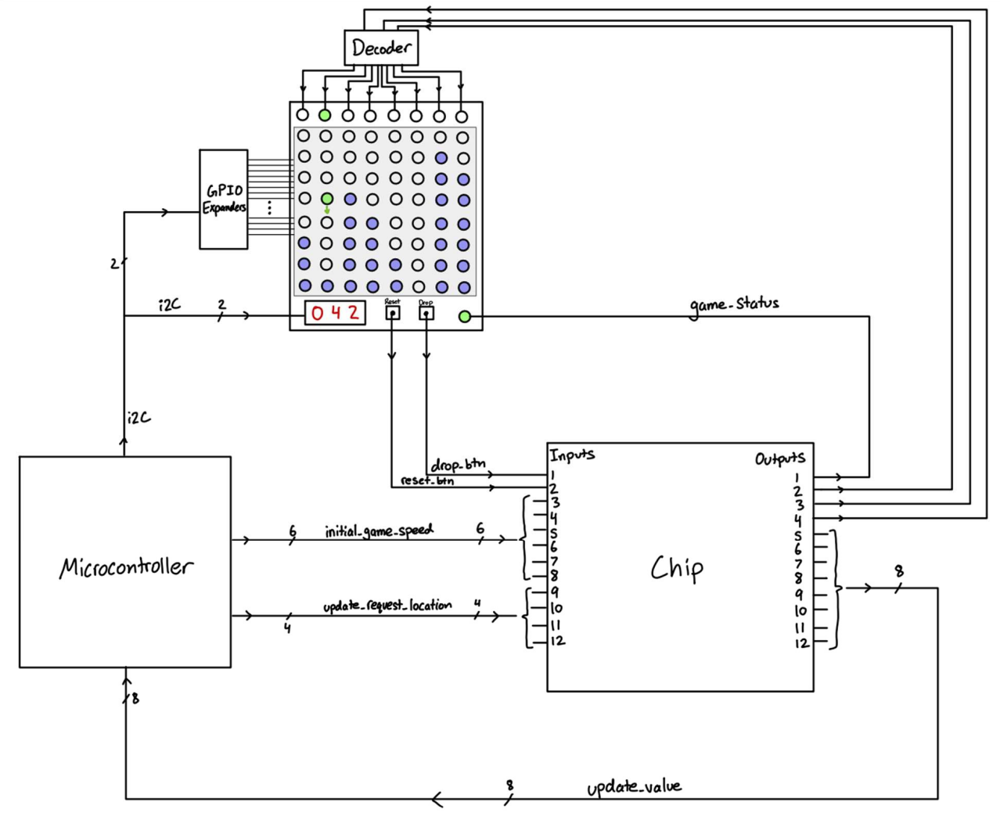
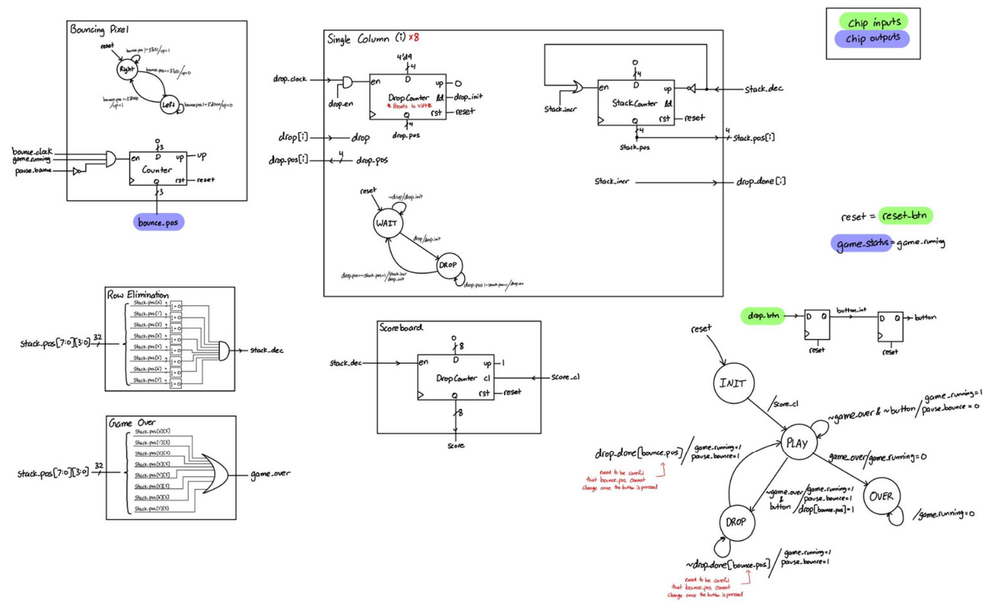
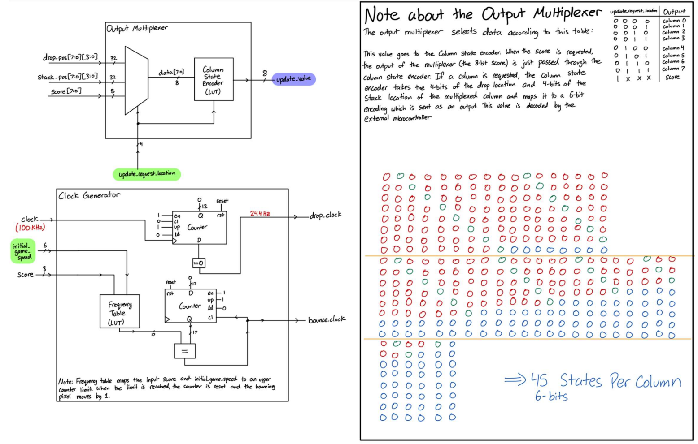
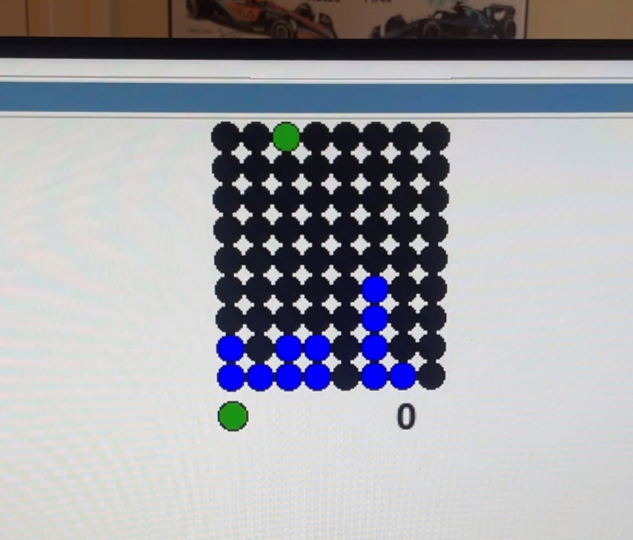

# ModifiedTetrisV2

Navod Jayawardhane
18-224/624 Spring 2023 Final Tapeout Project

## Overview

My design is a mix of a Tetris/Stacker game. The game is played on a 8x9 LED matrix, with blocks
of 1 pixel in size. The top bar of the game will be dedicated to the dropper, which will consist of a
single pixel bouncing across the row.
Whenever the player presses a buƩon, the bouncing pixel will stop, and a dropping animation
will start, where a stream of green pixels light up in the corresponding column, and when the
pixel hits the boƩom, a steady blue pixel will light up. The bouncing pixel resumes and the player
keeps placing blocks.
Whenever a full row of blocks is placed, the row is eliminated and the game shifts down. The
score, shown on 3 7-segment displays, is incremented. AŌer a certain score, the bouncing will
speed up to increase the difficulty. If the stack of blocks reaches the top row, the game will end.
A single status LED will illuminate green or red based on whether the game is in play, and a reset
buƩon will act as the start game buƩon.

## How it Works

The top bar of the game is a simple counter/FSM design controlling whether the pixel is moving left or right, with pausing functionality.
When the drop button is pressed, the main game FSM pauses the top bar, and starts a counter causing the pixel to fall down the row. Another counter keeps track of the current column stack so when the dropping counter equals the current column stack, the current column stack is incremented and the game continues. The game checks whether all of the columns have >0 blocks to decrement the stacks and increase the score, or if any blocks reach the max height to end the game.
The 100KHz clock is split into slower enables to control the bouncing pixel speed and dropping speed. The bouncing pixel speed is increased as the score increases to increase the difficulty of the game.

## Inputs/Outputs

Outputs:  
Pin 1 – Game Status (0 = Stopped, 1 = Playing)  
Pin 2-4 – Bouncing Pixel location (routed directly to the display)  
Pin 5-12 – Update value (value corresponding to the state of the column or points score – MUXed as
requested by the microcontroller)

Inputs:  
Pin 1 – Drop block (buƩon input)  
Pin 2 – Reset/Start Game  
Pin 3-8 – IniƟal Speed/Difficulty (staƟcally set by the microcontroller to set the iniƟal game clock)  
Pin 9-12 – Update Request LocaƟon (set by the microcontroller to MUX the outputs to update the game  
state on the microcontroller – locaƟons include the 8 columns and point score)

A 100KHz clock is required to keep game timing.

## Hardware Peripherals

72 RGB LEDs
Microcontroller to decode the game state
Decoder to display the bounding pixel locaƟon
I2C GPIO expander to drive all LEDs from the microcontroller (ex. PCA9555)
4-digit I2C 7 Segment display
Reset and Drop buttons
All misc power electronics required to drive the LEDs as needed
PCB to mount all of the components

## Design Testing / Bringup

To test the design, simply connect a clock, drop and new game buttons, and play. To view the game as it is in progress, setup a Raspberry Pi to quickly cycle through all of the possible request locations and display the game state. A CocoTB program was also used to test the game, where the drop button was asserted randomly, and the state of columns were tracked.

## Media

