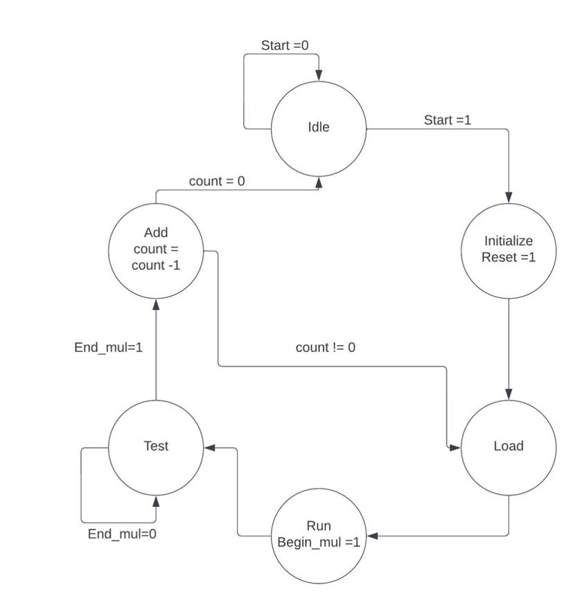

# 8-bit Multiplier - Accumulator 

Nikhil Dinkar Joshi 
18-224/624 Spring 2023 Final Tapeout Project

## 1. Overview

The multiply-accumulate (MAC) or multiply-add (MAD) operation is a frequent operation in computing, particularly in digital signal processing, that calculates the product of two numbers and adds that product to an accumulator. 
A multiplier-accumulator (MAC) unit is the hardware component that executes the function, which is also sometimes referred to as a MAC or MAD operation.
Mathematical equivalent of this operations can be given by: 

Equation 1

$$\sum_{k=0}^n Ak * Bk $$

## 2. Project Description

In this Project, an 8-bit unsigned MAC unit will be implemented. Ak and Bk are 8-bit unsigned operands, and S is the result of their multiplier and addition. At the beginning of each multiplication cycle operands will be loaded in A and B registers and the result of each multiplication operation will be added to the previous value present in accumulator register S. The process will be repeated ten times. i.e. n= 9 in Equation 1
Overall architecture is given in Figure 1

Figure 1

## 3. Submodule Description:

### 3.1 MAC Controller Module:

Control Signals:

Inputs:

1) Reset: asynchronous reset. Resets all the registers, multiplier, and add-accumulator modules.
2) Start: Begins MAC operation
3) Clock
4) End_mul: end of every multiplication cycle.

Outputs:

1) Load_op: signals Reg A and Reg B to load next pair of operands.
2) Begin_mul: signals multiplier to begin multiplication operation.
3) Add: signals add and accumulator module to add and accumulate the result of
	multiplication operation.
4) Finish: Signals each multiplier and accumulate cycle is done.
5) Reset_cmd : Resets all the registers, multiplier, and add-accumulator modules at the start of each computation cycle.

A controller's Finite State Machine (FSM) is shown in Figure 2. Upon receiving an active Start signal, the FSM moves from the Idle state to the Initialize state. 
A Reset command is generated in the Initialize stage to reset all functional units and registers. 
Following one clock cycle, the FSM transitions to the Load state, at which point it instructs the input registers to load a pair of operands.

The FSM moves to the Run state to begin multiplication as soon as the operands are loaded. 
Following one clock cycle, the FSM transitions to the Test state and waits for the multiplier unit to finish its operation. 
The FSM moves from the Test state to the Add state upon receiving an active End_Mul signal from the multiplier unit.

The controller instructs the add-accumulator unit to add and accumulate the product of the multiplication in the Add state. 
In addition, it decrements a counter that keeps track of the number of cycles of operand pairs. 
Ten pairs of operands have to be cycled. If the number of operand pairs is less than 10, the FSM transitions to the Load state to load the next pair of operands. 
If there are ten pairs of operands, the FSM enters the Idle state and waits for the next ten pairs.

Figure 2

### 3.2 Multiplier Module:

8 bit multiplier module using shift/add multiplier. The multiplier module will consist it own controller , multiplicand unit, adder unit and multiplication result unit. 
Shift and add methods are used in the Shift/Add Multiplier to perform multiplication. 
According to the multiplier's LSB bit value, a multiplicand value is added and accumulated. 
At each clock cycle, the multiplier is moved one bit to the right and the LSB value of the multiplier is evaluated. 
It executes a shift operation if the LSB value is 0. The multiplicand is moved one bit to the right and added to the accumulator if the LSB value is 0.
Carry select adder is chosen to implement the adder unit. multiplication result unit stores the accumulated output of the adder and multiplier. 

Figure 3

#### 3.2.1. Controller Multiplier Module:

This controller is similar to the controller described above and is used to control the shift/add multiplier.

Control Signals:

Inputs:
1)	Reset
2)	Start
3)	Clock
4)	LSB
Outputs:
1)	do_Add
2)	do_Shift
3)	Load_Mul
4)	End_Mul

FSM:

The FSM has five states Idle, Init, Check, Add, and Shift. 
The FSM moves between states depending on the current state and the input signals. 
When the FSM receives a Reset signal, it goes to the Idle state, and the counter is set to 0. 
If the current state is Idle, and the Start signal is active, the FSM transitions to the Init state. 
In the Init state, the FSM sets the Load_Mul signal to load a pair of operands. 
In the Check state, the FSM checks the LSB signal and transitions to the Shift state if it is 0, or the Add state if it is 1. 
In the Add state, the FSM sets the do_Add signal to command the add-accumulator unit to add and accumulate the result of multiplication. 
It also decrements a counter that keeps track of the number of operand pairs cycled. The output of the adder and multiplier are stored in the multiplier block. 
It comprises of a shift register with 17 bits and a multiplexer for shift-right operation.
In the Shift state, the FSM checks the counter and transitions back to the Check state if it is less than "7." If the counter equals "7," the FSM resets the counter and goes back to the Idle state and generate End_Mul signal.

### 3.3 Add and Accumulate module:

The Add accumulate unit has one input which is 16-bit wide (output of multiplier module). 
This input is added to the existing value present in the accumulator register. 
The result of this addition is then stored in the accumulator register. 
The operand provided to the add accumulator's input is a 16-bit value, whereas the add- accumulator's output is a 20-bit value.

The add-accumulator accepts 10 pairs of operands, each of which (after multiplication) produces a 16-bit wide result. 
10 is represented in binary as 1010, which is a 4-bit value. 
Given that we are adding the operand 10 times, we are essentially multiplying the operand by ten. 
The effect of multiplying a 16-bit value by a 4-bit value is 16+4 = 20 bits of accumulator register storage. 
To convert a 16-bit value to a 20-bit value, the inputs of the register's top four bits are linked to zeros.

Figure 4

#### 3.3.1 20 bit carry select adder:

The carry-select adder contains several 4-bit Ripple Carry Adders and some multiplexers. 
A carry-select adder may be subdivided into 4 bit sections. 
20-Bit Carry-Select adder is shown in Figure 5 as a block diagram. 
The carry-select adder is used for addition process in multiplier block and add-accumulator block.

 

Figure 5

## 4. Inputs/Outputs

### 4.1 Inputs:

1) Clock 
2) Reset
3) Start
4) Operand A: 8 bit
5) Operand B: 8 bit
6) Input_done.

Operand A and Operand B are taken in serially at every clock edge and saved in 8-bit input register. Once 8-bits of both operands is taken in, the Input_done flag is set.

### 4.2 Outputs:

1) Finish
2) S (Result) : 20 bit
3) Carry_out: 1 bit
4) End_Mul
5) Output_done

20-bit result is outputted serially when Finish is asserted. Once all 20-bits are outputted, Output_done flag is set.

End_mul is used for verification purposes.

## 5. Design Testing / Bringup

Test bench files :
1)	8 bit multiplier : top_multiplier_tb.sv
2)	20_bit_carry_select_adder.sv: 20 bit adder 
3)	8_bit_carry_select_adder.sv: 8 bit adder
4)	20 bit add-accumulate: add_accumulate_tb.sv
5)	MAC (top module): mac_tb.sv and max_mac_tb.sv

### 5.1 Verification Methodology

A. Mac (multiplier accumulator) is the top module. Two test benches do verification of this top module, and both are self-checking.

a.Max_mac_tb.sv : This test bench verifies that the accumulator register can hold the maximum possible value. 10 pairs of operands A and B with value 255 are inputted. The maximum possible value in the case will be 255 x 255 x 10 = 650250. The output of this test bench is shown in the figure below.

Figure 6

Figure 7

b. mac_tb.sv : This test bench provides ascending and descending inputs to the module. Operand A increases from 0 to 9 and operand B decreases from 255 to 246. The output for this test bench is shown in the figure below.
This test bench verifies the timing of all the control signals and and synchronizes the input operand change with the control signals. 
Every new operand and Start signal is asserted once End_Mul is high (Finish of 1 multiplication Cycle).

Figure 8

Figure 9

## GDS Layout

Figure 10

## References

1] Ramos, J. J. (n.d.). 8-by-8 bit multiplier accumulator http://www.mass-talent.ca/uploads/3/9/3/0/3930953/multiply_acccumulator_design.pdf 
