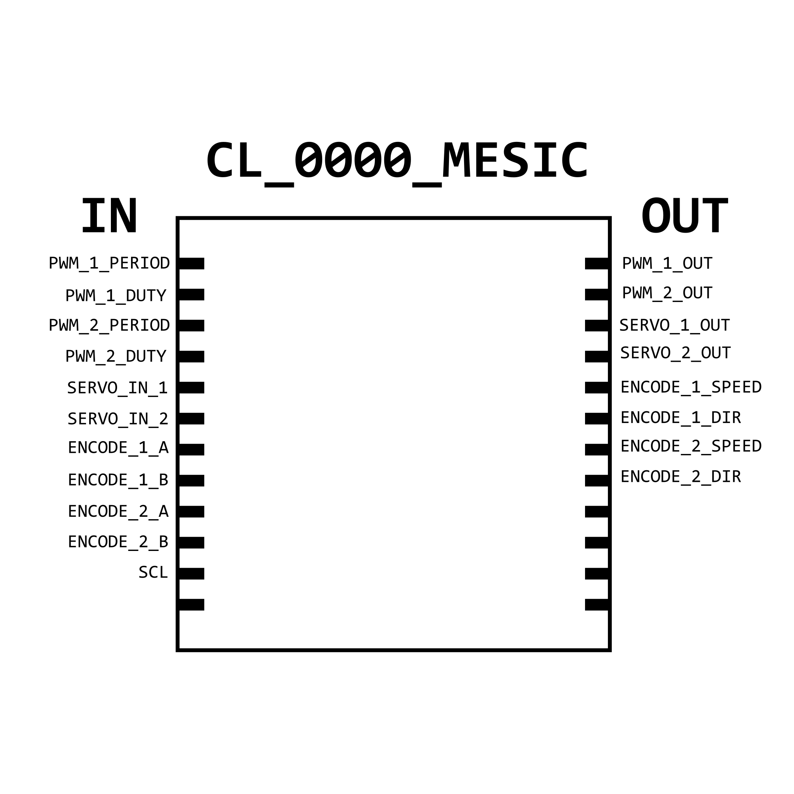
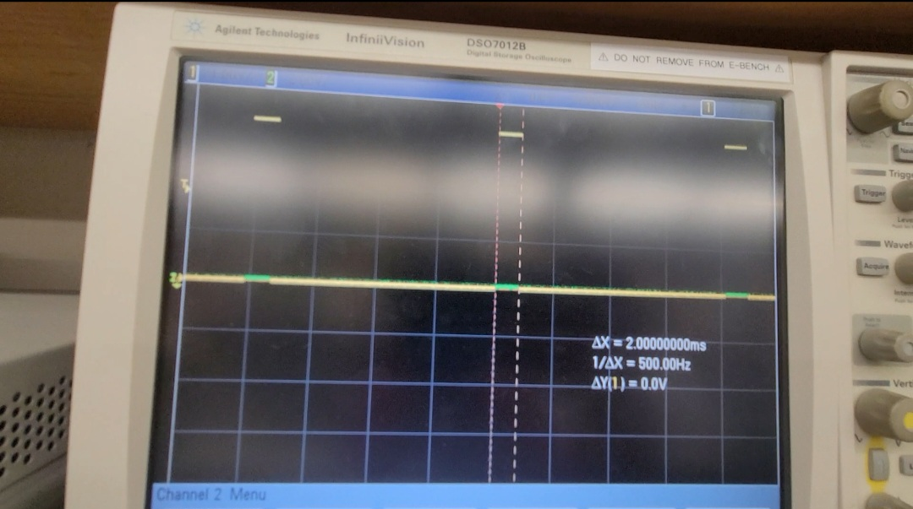

# CL_0000_MESIC: Motor Encoder and Servo/PWM Driver ASIC

Varun Kumar's 18-224/624 Spring 2023 Final Tapeout Project

## Overview:

The CL_0000_MESIC is a Motor Encoder and PWM driver IC. It outputs PWM (Pulse Width Modulation) from 4 outputs, and takes in A and B inputs from a Quadrature Encoder to deliver speed and direction information about the currently operating motor.

## The Internals:

In order to save some inputs, every input is serial. On every clock cycle of the input microcontroller, each value on the serial lines is stored in a register, 8 bits for the servo and 16 bits for the general PWM. This register is constantly connected to the PWM output module, but only updates every time the register is "filled". The module ensures that the PWM output stays at HIGH for the appropriate amount of time, such that the receiving device operates as expected.

For the quadrature encoded module, the system is much simpler. The module counts how many clock cycles in which A is HIGH and B is LOW and outputs this difference serially as it goes. For direction determination, depending on which wave sees a positive edge first, the module outputs a 1 or a 0.

## Inputs/Outputs

The Clock Speed of the CL_0000_MESIC is exactly 1 MHz, as the PWM outputs are determined on the basis of clock cycles.

The I/O is pictured here:

## Hardware Peripherals

In order to use the MESIC, have your desired hardware connected (Servo, DC Motor, or Encoder) and a 5V source for correct operation.

## How to Work With the CL_0000_MESIC (Design Testing/Bringup):

This chip is designed to be used in conjunction with a microcontroller. Ensure that whatever clock your microcontroller is using is connected to the SCL input of the chip; this way, no matter what the microcontroller's clock speed is, the chip will output what your system needs.

All inputs are serial. In order to output something serially from a microcontroller, use the shiftOut function for Arduino. For servos, input a number corresponding to the extent of motion you desire serially, and the chip will output the appropriate PWM for the servo. In order to use general PWM, you must first input the period and the duty cycle of your desired wave, in terms of clock cycles. Keep in mind, the clock frequency of the chip is 1 MHz, so each clock cycle is 1 microsecond. 

For the encoder inputs, connect the A and B inputs to their respective inputs for a single motor. The chip will output the difference between the positive edges of the A and B signals serially from one of its outputs, and the direction that the motor is rotating as a 1 or a 0. 

## Media:

CL_0000_MESIC outputting a 2 ms PWM Signal! 

