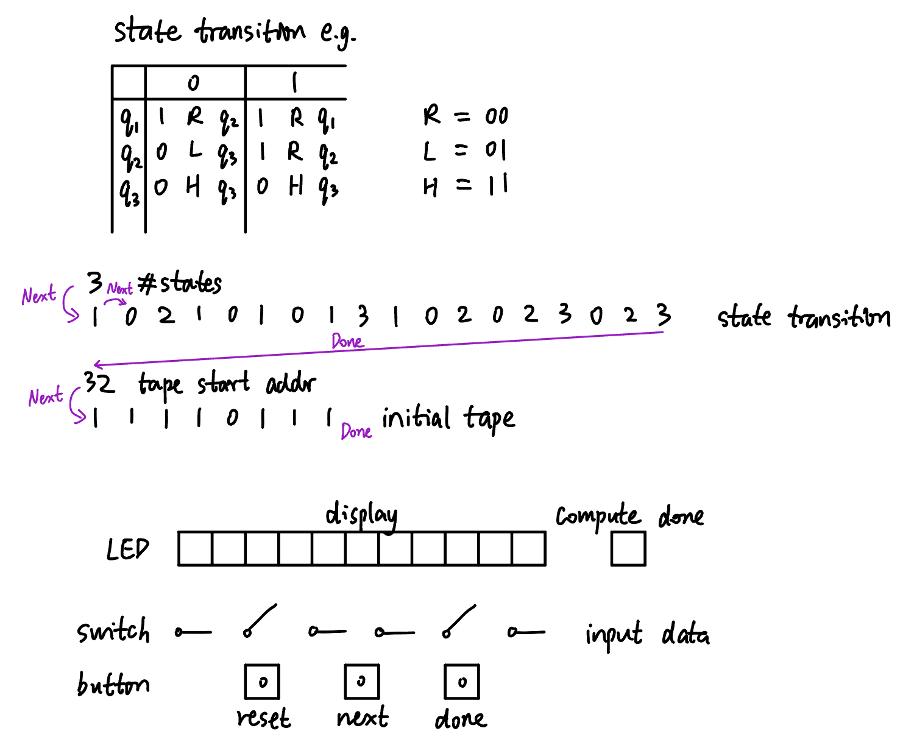

# Turing Machine
Zhiying Meng 18-224/624 Spring 2023 Final Tapeout Project
## Overview
This chip takes in a Turing Machine style state transition table and initial tape values, then displays the computation process. Only support tape with values 1 and 0.
## Inputs/Outputs
Inputs:
- 6 switches used for input data (number of states + state transition table + tape start address + initial tape values)
- 3 buttons for controlling the computation process

Outputs:
- 11 LEDs for displaying the tape values
- 1 LED for indicating "Halt" or reach end of memory


## How it Works
The chip initially stores all the inputs into a 4$\times$64 memory. It takes the bit at the tape head and look for the corresponding actions in the state transition table (default state is 1).

For instance, in the above example, the first bit in the tape would be 1, so it will go to state 1 with input 1 which has instruction 1 R q1. During the process, it displays the new tape value, rewrites it with 1, moves the tape head to the right, and goes to state 1.

After it has processed all the values on the tape, it will either go to "Halt" state where the tape stops moving, or it will reach the end of the tape and stops.

The diagram below is the RTL design to achieve this function.


## Design Testing / Bringup
When testing the chip, input a valid Turing Machine state transition table and a initial tape value using the switches. Press the "Next" button to indicate the input can be taken, and press the "Done" button to indicate the end of the inputs.

The chip will then start to compute. The tape will move by 1 index after the "Next" button is pressed and the 11 LEDs will display the corresponding tape values. It will continue the process until the 12th LED lights up to indicate it finishes computing.

With the example provided before, the expected outputs from the LEDs are as below:

```
00000000000
00000000001
00000000011
00000000111
00000001111
00000011110
00000011111
00000111111
00001111111
00011111111
00011111110
00011111110
compute done
```

## Media
Testing using FPGA:


