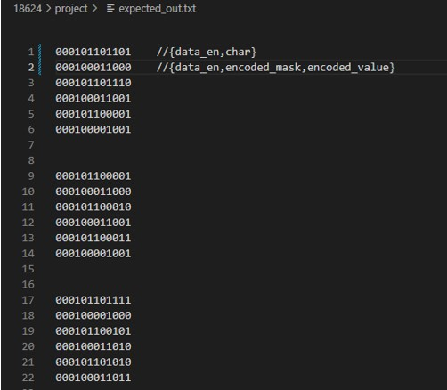

# huffman_encoder

Anusha Raghavendra
18-224/624 Spring 2023 Final Tapeout Project

## Overview

//Algorithm
1. Read the characters(leaf node) and their corresponding frequencies array
2. First sort the input node list, find 1st and 2nd minimum. If tied, sort according to the ascii value
3. Allocate them to huff_tree, assign only is_leaf_node, child nodes (not parent node)
4. Merge nodes--> create internal node- sort and then add to huff tree -repeat until only 1 node is left
5. Iterate until the root node 
6. Start from i=count-1, left_node=2i, right_node=2i+1 (i decrementing from count-1 to 0), where count is the number of unique character count
7. Traverse the entire array to assign the parent node and level in the binary tree
8. Traverse again to assign the encodings to each character

## How it Works

1.	This design primarily comprises of a module huff_encoder, which can take one character as an input(io_in[7:0]-ascii value of characters), its corresponding frequency(io_in[10:8]) and data enable signal(io_in[11]) in a serial fashion until all 3 characters are read and collected in a register. A state machine is created with DATA_COLLECT as reset state. In total, there are 7 states. Each state takes one or more clock cycles. Hence, output encodings along with the mask value will be available after certain clock cycles. Once the output is ready, io_out[8] is asserted to represent done signal. In the first cycle after output encodings are available, io_out[7:0] represents character, and in the second cycle after this, io[5:0] represents {output_mask, output_value}. This repeat until all the outputs are read out.  
2.	After reset is asserted down, FSM goes to DATA_COLLECT state. 
3.	2nd state would be NODE_CREATE state, where character and frequency array is sent to node_create module to create a node list containing node and its correspinding frequency each of node_t type. This module returns the initial node.
4.	Then it goes to 3rd state: SORT, where list of nodes is being fed as input to a node_sorter module. Output is sorted list as per their frequencies. In case of tie, it sorts according to their ascii values. This tie breaker logic differentiates the Huffman encodings.
5.	4th state is MERGE, where a module merge_nodes select the first and second minimum from the sorted list, and creates a new node with a frequency equal to the sum of their frequencies. Other fields in the struct are set accordingly such as right and left nodes, which holds the ascii values of the merged nodes. This newly created node is added to the node list 
6.	Steps 3 and 4 are repeated until only 1 node is left 
7.	State 5 is the BUILD_TREE, where Huffman tree (array of nodes of type huff_tree_node_t) is created.  
8.	State 6 is ENCODE, where it's traversing the tree to assign parent and level in Huffman tree
9.	It then goes to ENCODE_VALUE state, where tree is traversed again to assign encodings based on parent encodings and level
10.	Final state is SEND_OUTPUT, where it just extracts the encodings and mask value for those input characters in the order of character input and serially sends it out with out_valid signal in io_out[8] bit.

## Inputs/Outputs

io[7:0] - ascii_value of character (only character 'a' to 'o')
io[10:8] - frequency of each of character (only 2 bits, hence range [1:3])
io[11] - data enable signal

## Design Testing / Bringup

**Verification:** 
In the project repo, huff_enc_tb.sv is the system verilog testbench which parses the inputs (characters and frequency) from “input_vector.txt” and generates output encodings along with the mask value in a serial fashion, which are then compared with the values (expected_out.txt) generated from golden model (huff_test.py). Assertions are added in this testbench to compare against the golden model outputs.
Python model huff_test.py sparse the same input file (input_vector.txt) and output the encodings to “expected_out.txt”, which are later used by system Verilog testbench to compare against its generated output.
**Input characters are to be between character ‘a’ and ‘o’, with corresponding frequencies within the range of 3 (only 2 bits) due to gate count constraints.

Steps for using iverilog (or) simply run ./run_script.sh
	source /afs/club.cc.cmu.edu/projects/stuco-open-eda/bashrc
	Add more vectors in the input_vector.txt (characters, frequencies), update the vector number in the huff_enc_tb.sv 
`define VECTOR_NUM 5 //change as per the vectors in input_vector.txt
	sv2v huff_enc.sv > huff_enc.v
	sv2v huff_enc_tb.sv > huff_enc_tb.v
	python3 huff_test.py
	iverilog -o sim huff_enc_tb.v huff_enc.v
	. /sim
Or 
	./run_script.sh 
Or using VCS:
	vcs -sverilog -R -top tb_top -debug_access+all huff_enc.sv huff_enc_tb.sv

**##Testing**
1. Set io_in[11:0] = {1'b1, freq_in, data_in}
where, freq_in = frequency of character, data_in- ascii value of that character
Send this input for three cycles (as only maximum 3 characters) can be encoded with this module 
2. Deassert data enable signal (io_in[11]) after 3 clock cycles to indicate that three characters are fed to the module.
3. As soon as io_out[8] is asserted, start reading the values which represents ascii_value in the first cycle and {encoded_mask, encoded_value} in the consecutive cycle. This repeats until all three encodings are recieved. 
4. Once this vector testing is done, repeat the same procedure for next set of vectors

**##Enhancements**
1. Expand the input range to all characters
2. Instead of feeding in characters and frequencies, design the module to take input string, calculate the frequency of each unique character and encode it
3. Increase the MAX_CHAR_COUNT from 3 to a larger number (as of now, only 3 characters are encoded with this module)
4. If less than 3 chars are fed, it gives erroneous outputs 
