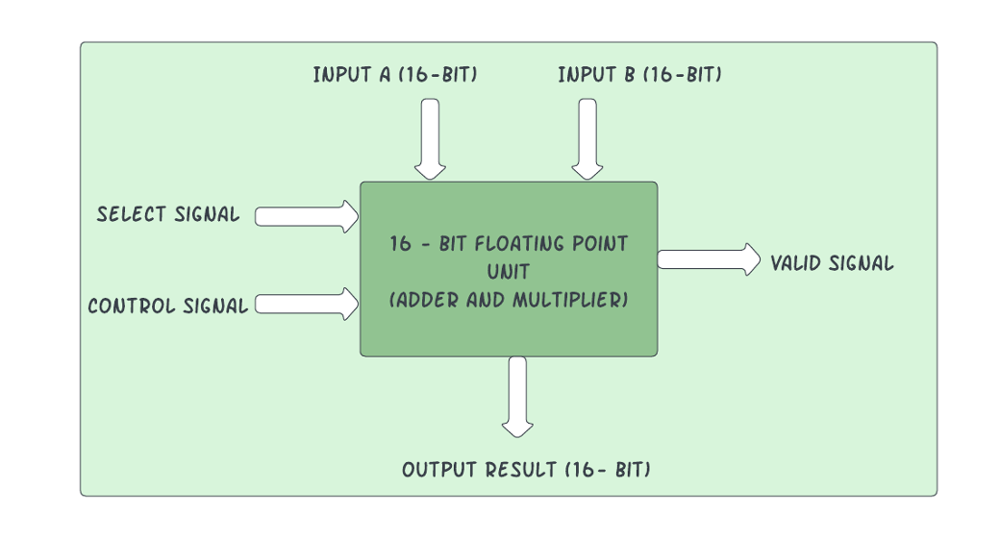
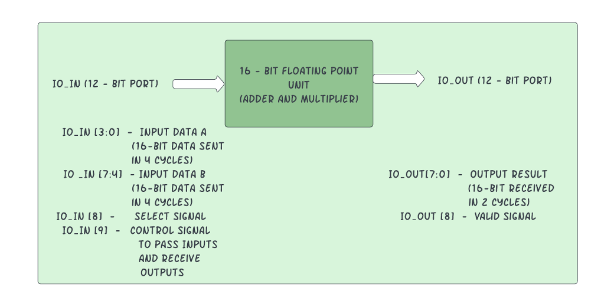
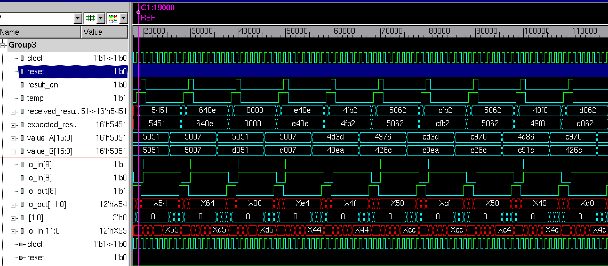

# 16-Bit Floating Point Unit

By: Sri Lakshmi
18-224/624 Spring 2023 Final Tapeout Project

## Overview

A 16-bit Floating point Unit (Adder and Multiplier) follows FP-16 (half-precision) format. A select signal is used to choose between Addition and Multiplication of two 16-bit Input Floating Point Numbers. The 16-bit signals use 1 bit for the sign, 5 bits for the exponent, and 10 bits for the significand or mantissa. 
Along with two 16-bit input signals, select and control signals are given as inputs. The resultant output is a 16-bit result and a valid signal.

* Format: Sign - 1 bit Exponent - 5 bits Mantissa - 10 bit
* Exception Encoding
 * NaN 0 11111 1111111111
 * +∞ 0 11111 0000000000
 * −∞ 1 11111 0000000000
 * Underflow 0 00000 0000000000

## How it Works

An FSM is used in the top-level to control all the inputs, outputs, and control signals. The select signal is set to high for Addition and low for multiplication. The control signal is set to high when the inputs are given to the system and is low for the rest of the operations. Each Sub Module (Adder and Multiplier) takes in 2 16-bit data input values and results in One 16-bit Result and a valid signal. The Sub Modules are Combinational. The 16-bit inputs take in 4 cycles to fully obtain. And the 16-bit outputs take in 2 cycles to be generated out. 

Block Diagram: 

Detailed I/O Description: 

## Inputs/Outputs

Inputs: 

To give in two 16-bit Inputs, we are doing it in 4 cycles. 10 of the 12 available ports are used.

* IO_IN [3:0] 	-	Input for Signal A
* IO_IN [7:4] 	-	Input for Signal B
* IO_IN [8]		- 	Select Signal
* IO_IN [9]		-	Control Signal
* IO_IN [11:10]	-	Not Used

Output: 

To receive a 16-bit output along with the valid signal, we do it in 2 cycles. 9 of the 12 available ports are used.

* IO_OUT [7:0]	-	Output Data. 
* IO_OUT [8]		- 	Valid Signal. 
* IO_OUT [11:9]	-	Not Used

## Design Testing

For the testing of the design, the FSM is configured from a test bench. 
The inputs are given in 4 different clock cycles. The control signal is set high along with configuring the select signal. In the next 4 consecutive clock cycle, the inputs are passed through the above-mentioned configuration. Once the inputs are passed, the control signal goes low, and the results are populated in the next two consecutive clock cycles along with the valid signal. 

Module fpu_16_tb has the testbench used for testing the design. It also contains the checker scripts and validates the received results with the expected ones.

For Example: 

Inputs: 
If Inputs A = 16'h4D3D and B = 16'h48EA
Select would be high for Addition. Expected Result would be: 16'h4FB2

In this configuration the test bench would be something very similar to: 
1. In first clock cycle:  
io_in[8] = 1	- Making select high for addition. 
io_in[9] = 1	- Making Control signal high to give inputs.
2. In the next consecutive clock cycles, the input data is given as below. 
* Clock Cycle 1:
    		 io_in[3:0] = D
    		 io_in[7:4] = A
* Clock Cycle 2:
    		io_in[3:0] = 3
    		io_in[7:4] = E
* Clock Cycle 3:
    		io_in[3:0] = D
    		io_in[7:4] = 8
* Clock Cycle 4:
    		io_in[3:0] = 4
    		io_in[7:4] = 4
3. In the next clock cycle, the control signal io_in[9] is made low. 
4. In the next 2 clock cycles, the output is generated out through the io_out port as below: 
* First Clock Cycle: 
	io_out[7:0] 	- 'B2
	io_out[8] 		- 1
* Next Clock Cycle:
	io_out[7:0] 	- '4F
	io_out[8] 		- 1
## Simulation Results: 

