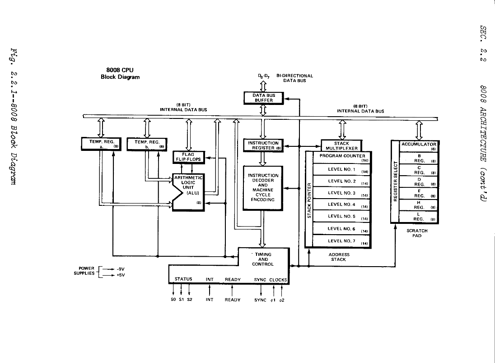
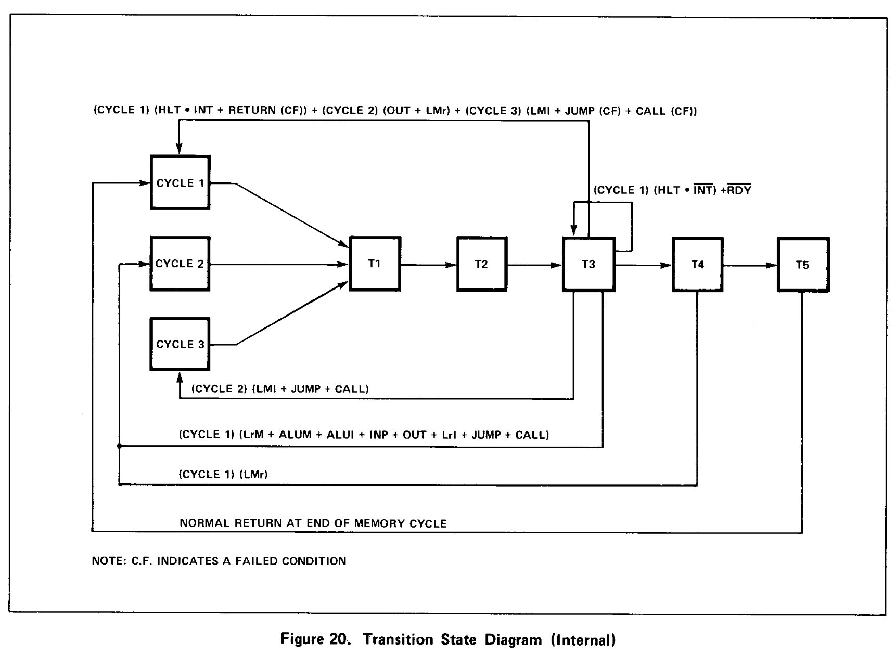
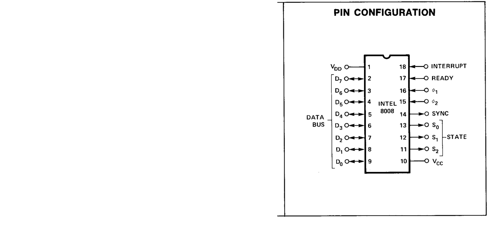
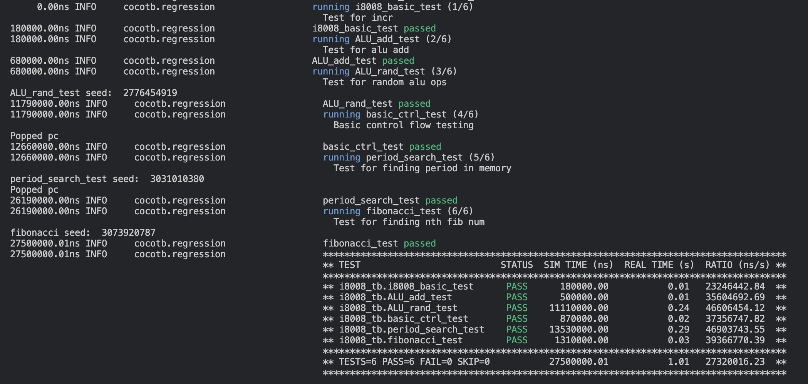

# Intel 8008-like Chip
Brendan Wilhelm
18-224/624 Spring 2023 Final Tapeout Project

## Overview

This project implements the Intel 8008 instruction set and microarchitecture
as specified in the User Manual. It uses an accumulator register for any
operations carried out, and possesses a register file, program stack,
and no on-chip memory. Each cycle the instruction or data is passed into 
the chip, where it may then take up to 15 states to execute.

## How it Works
The 8008 uses an FSM which moves through up to 3 memory read/write cycles 
per instruction. Each memory cycle consists of up to 5 stages. T1/T1I and T2
output the lower 8 bits, and upper 6 bits of the memory address and two bits
of the data access type, respectively. WAIT occurs until the READY signal
propogates (takes 2 cycles), and then the 8 Data_in bits are written into 
the instruction register (CYCLE1), or read into the register file or stack.
If it's a HALT instruction, it will move to the STOPPED state. Other
instructions may move to the T4 and T5 states for data movement and ALU ops,
and they may behave differently on different cycles. There is a python simulator
which can be used to input custom instruction streams.
The 8008 has 7 data registers, with the 0th being the accumulator, and 5th and 6th
used for Low and High bits of data memory accesses. The stack has 8 registers
with 14-bit width which can be pushed or popped with CAL and RET. Look over 
the attached manual (docs/8008UM.pdf) for more instructions, and the test bench 
for how to input them.

Here is the diagram describing the internal state and transitions based off of
the current instruction. A simplified diagram can be found at docs/State_diagram.png.

## Inputs/Outputs

(This is the original 8008 pin config, but similar to what the 8008-like uses)

  inputs:   

    - Data_in:

        8 bits (Pins 7:0) of data with 0 being the smallest bit

    - INTR: 

        Interrupt (Pin 8) used to exit STOPPED state

    - READY: 

        Data ready (Pin 9) used to exit the WAIT state and input the byte to the internal bus

    - Pins 10 and 11 unused

  outputs:

    - Data_out: 

        8 bits (Pins 7:0) of data with 0 being the smallest bit

    - State: 

        Outputs encoding of the processor FSM state (Pins 10:8) (T1 = 3'b010, T1I = 3'b110, T2 = 3'b100, WAIT = 3'b000, T3 = 3'b001, STOPPED = 3'b011, T4 = 3'b111, T5 = 3'b101)
   
    - Sync: 

        Indicates if there is data on the Data_out pins (Pin 11)

## Hardware Peripherals
The only necessary peripheral is something to simulate memory for the
processor. I plan to use a raspberry pi since the test bench is 
written in python and should be easily modified for actual use.

## Design Testing / Bringup
To test the design, I recommend looking at the tests directory. For a quick
summary, I recommend pushing rst high while cycling the clock a couple times.
Then it will output address 14'd0, and expect an instruction to be fed into
the D_in pins along with the READY signal high. You can pull READY low after
just one cycle, but leave the instruction on the input pins until the 
processor enters state T3. Monitor the state output pins, because every
time you see T1/T1I and T2, this is the next memory address to be 
written to or read from depending on the upper two bits in T2. I 
recommend looking at the example programs or User Manual for what 
instructions to input on a sample case.

A successful test bench output will look something like this.

The clock speed is arbitrary, as long as there is time for instructions to
propogate in every state. To test the project, you can look at the example
tests in the tests/i8008_tb.py file. Or, you can run the existing tests by
running "make" in the tests directory. Every cycle is simulated by the python
simulator as the design executes, so you can update the python simulation, 
and then call the check_state function to ensure it is in line with the 
python simulation. I'm still working on a test bench for the final chip,
but it will involve running a script very similar to the i8008_tb.py file
since this handles memory management, and processor state casing already.

If you want to make changes to the system verilog, then you can update
the verilog implementation by running the build.sh script.

To aid with debugging, you can enable state printing for both the python 
and verilog implementations by setting verbose = True in the failing
testcase.

## Unimplemented 8008 Features
I don't believe that the interrupt feature behaves quite right. 
Unfortunately I didn't have time to fix the interrupt functionality.
Currently its only use is to exit from a halt instruction, which
puts the processor in the STOPPED state indefinitely.

Due to concerns over signals stabilizing, the READY and INTR signals
take two cycles to propagate into the processor. This should give 
enough time for these signals and the D_in value to stabilize
before being read. 

## Final Comments
The 8008 FSM can be confusing when you first look at it. I recommend
looking through the internal state transition diagram, and reading
through the part of the User Manual which details specific execution
of all the instruction types by cycle and state. Another good tool
is the python model I created to test bench the verilog, and as far
as I can tell it executes exactly the same as the verilog, but only
updates the state after each instruction instead of going through the
whole FSM logic in multiple cycles.

For the tapeout and synthesis I used sv2v to convert the system verilog
to verilog since yosys had trouble with some of the system verilog I
was using. Because of that I've included both the system verilog and
verilog files in case there were any differences which I didn't catch.
This also made debugging a pain since I couldn't use any of the defines
that I had built up during the creation of the processor.

Again due to time constraints I was not able to test every possible
instruction, but I've verified enough of them that you should be 
able to write some programs like in the testbench.
